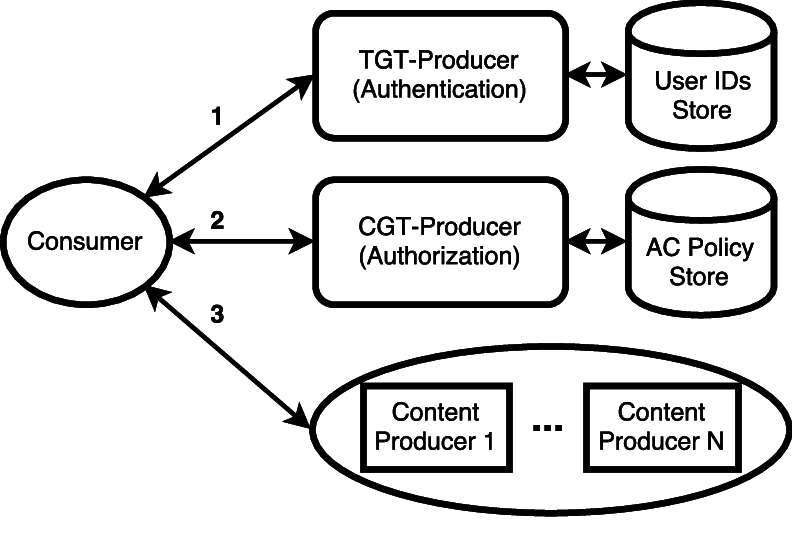

# KRB-CCN: Lightweight Authentication & Access Control for Private Content-Centric Networks

<p align="center">

</p>


Content-Centric Networking (CCN) is an internetworking paradigm that offers an alternative to today's IP-based Internet Architecture. Instead of focusing on hosts and their locations, CCN emphasizes addressable named content. By decoupling content from its location, CCN allows opportunistic in-network content caching, thus enabling better network utilization, at least for scalable content distribution. However, in order to be considered seriously, CCN must support basic security services, including content authenticity, integrity, confidentiality, authorization and access control. Current approaches rely on content producers to perform authorization and access control, which is typically attained via public key encryption. This general approach has several disadvantages. First, consumer privacy vis-a-vis producers is not preserved. Second, identity management and access control impose high computational overhead on producers. Also, unnecessary repeated authentication and access control decisions must be made for each content request. (This burden is particularly relevant for resource-limited producers, e.g., anemic IoT devices.)

These issues motivate our design of KRB-CCN - a complete authorization and access control system for private CCN networks. Inspired by Kerberos in IP-based networks, KRB-CCN involves distinct authentication and authorization authorities. By doing so, KRB-CCN obviates the need for producers to make consumer authentication and access control decisions. KRB-CCN preserves consumer privacy since producers are unaware of consumer identities. Producers are also not required to keep any hard state and only need to perform two symmetric key operations to guarantee that sensitive content is confidentially delivered only to authenticated and authorized consumers. Furthermore, KRB-CCN works transparently on the consumer side. Most importantly, unlike prior designs, KRB-CCN leaves the network (i.e., CCN routers) out of any authorization, access control or confidentiality issues. We describe KRB-CCN design and implementation, analyze its security, and report on its performance.

In this REPO we provide KRB-CCN implementation using CCNx software stack and the crypto-lib Sodium.
A detailed description of KRB-CCN can be found in the corresponding research paper:

- http://sprout.ics.uci.edu/projects/ndn/papers/krbccn.pdf

# Citation Information (bibtex): 
```latex
@INPROCEEDINGS{
    krb-ccn,
    AUTHOR="Ivan O. Nunes and Gene Tsudik",
    TITLE="KRB-CCN: Lightweight Authentication & Access Control for Private Content-Centric Networks",
    BOOKTITLE="ACNS 2018 Applied Cryptography & Network security",
    YEAR=2018
}
```
